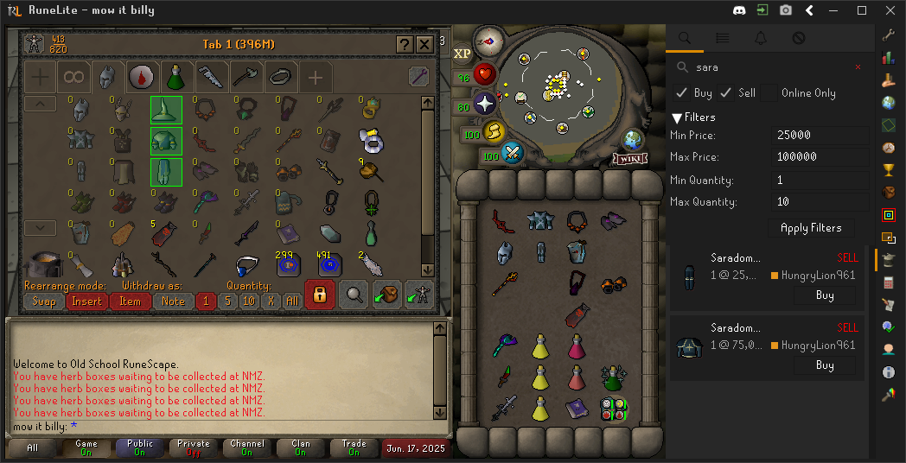
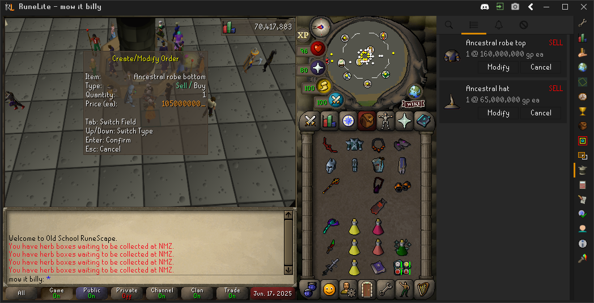
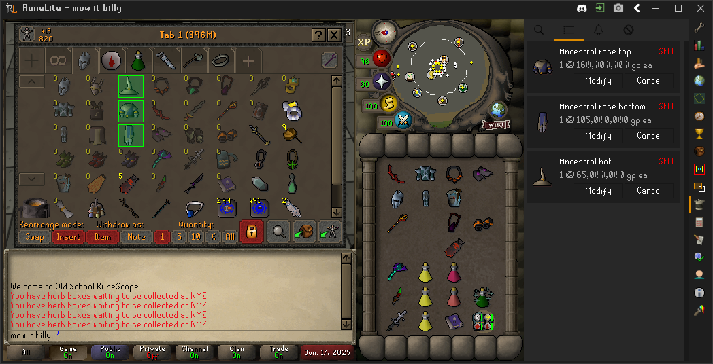
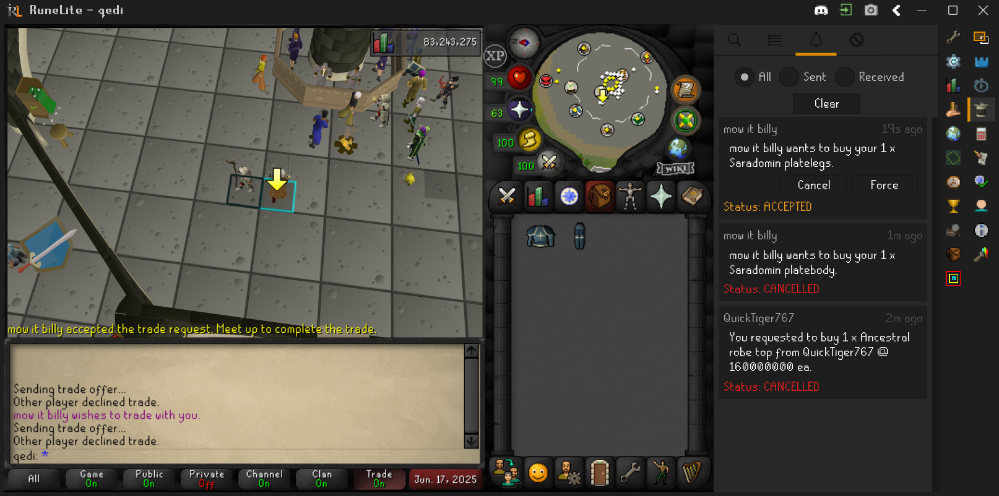
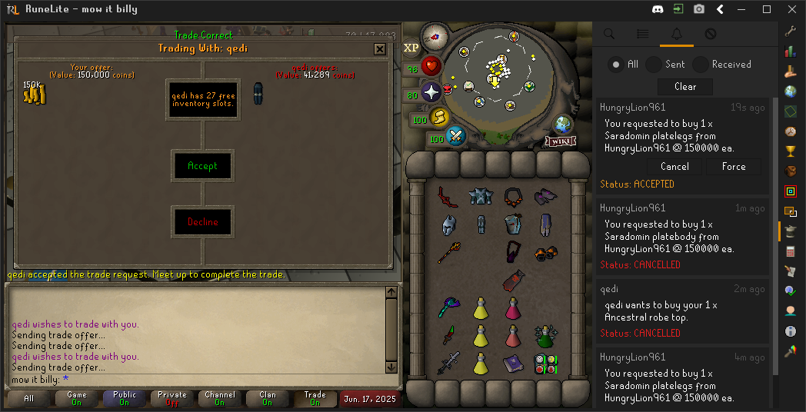
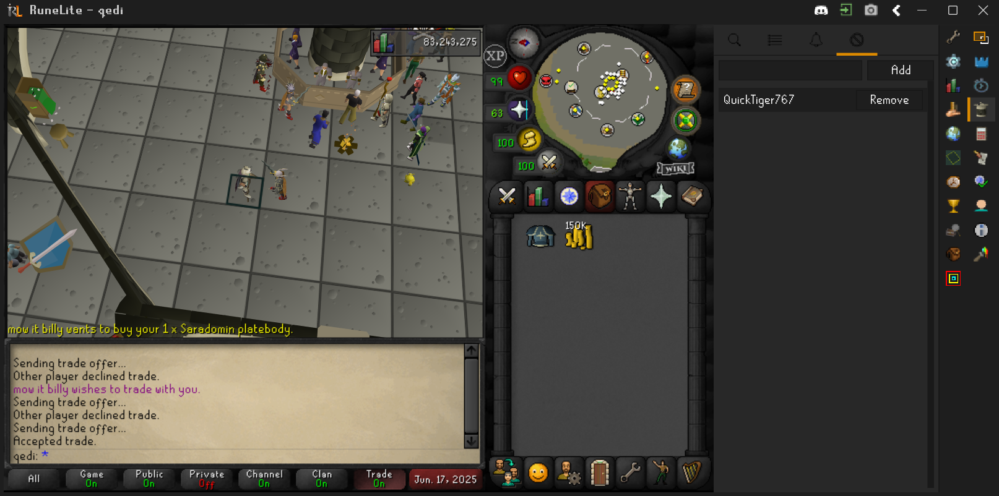

# RuckTaxes
I have a small bank and need to use items often, after realizing that the amount in % payed to the GE was massive.

My bank is breaking and thus the reason for such a plugin with inspirations from PoE.

A Runelite plugin that enhances OSRS trading capabilities with:

- **Enhanced Privacy**
    - No username storage on servers
    - Secure PGP key generation for each runelite instance
    - Anonymous listing creation with randomized identifiers

- **Server Security**
    - IP-based rate limiting
    - Abuse prevention system
    - DDoS protection measures

- **Trading Enhancements**
    - Bypass Grand Exchange trade restrictions
    - Bypass standard price boundaries
    - Eliminate transaction fees
    - Support for high-volume trades

- **Seamless Integration**
    - Native Runelite plugin
    - User-friendly interface
    - Minimal setup required

## Step-by-Step Instructions

### 1. Search for Items
Use the search feature with filters to find the items you need.

### 2. Create an Order
(Shift)right click an item to create a trade order.

### 3. Manage the Order
Once created, the order will be listed. You can bank your item(s) or keep them in your inventory for quick trading.

### 4. Handle Trade Notifications
Accept or ignore the trade notification when prompted.

### 5. Complete or Cancel the Trade
Once accepted, you can force complete or cancel the trade. You can also locate the player on the minimap or world map.

### 6. Finalize the Trade
Complete the trade in the trade window with validation.

### 7. Ignore lists
There is also ignore management.

## Additional Notes
- **Completed Orders**: Once a trade is finalized, the order is removed from listings and active orders.
- Ensure you verify all trade details before completing to avoid errors.

## ToDo's
- Add easy support for price input (1m, 1.1b etc.)
- Show other player's world when the trades have been accepted by both parties
- Ability to create orders swapping items instead of gold like: 5 lobsters for 1 shark ea
